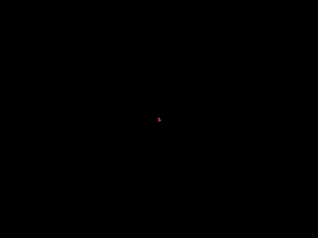
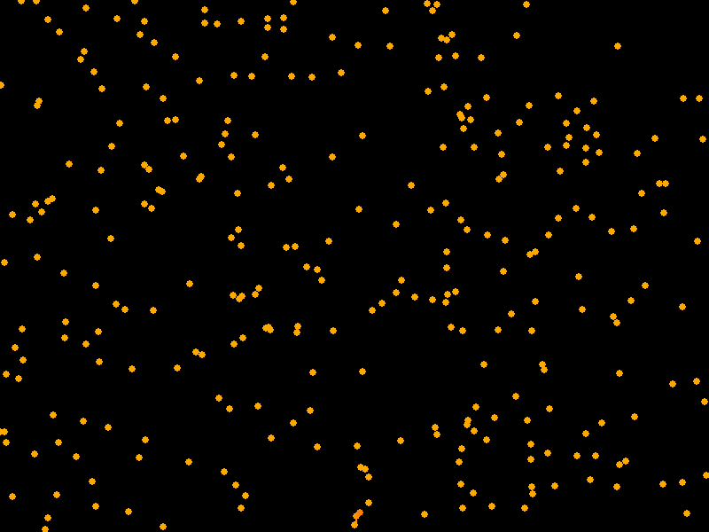

## 1. Frost simulation using Diffusion Limited Aggregation example result:

## 2. Coral like structure simulation using Diffusion Limited Aggregation example result:

## 3. Flower Simulation example results:

