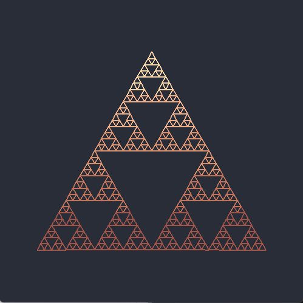
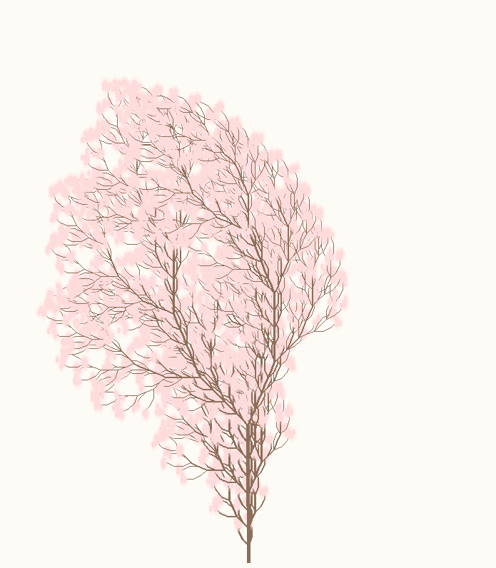
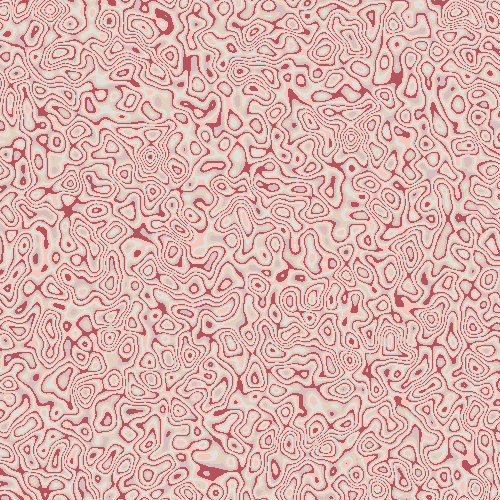

## 1. Frost simulation using Diffusion Limited Aggregation:

## 2. Coral like structure with DLA:

## 3. Simple example of the Sierpinski Triangle using L-Systems:

## 4. Tree using L-Systems:
[pattern source](https://paulbourke.net/fractals/lsys/)

## 5. Generative Art with Perlin Noise:
[color csv source](https://editor.p5js.org/StevesMakerspace/sketches/y3Q4xT9nP)

