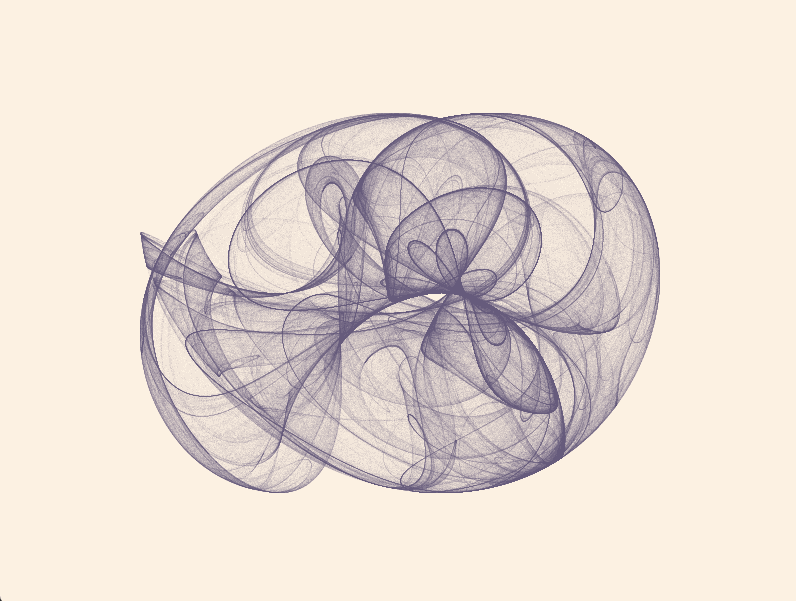
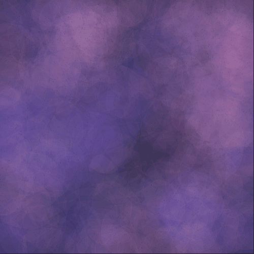

## 1. Clifford Attractors
[code source in C++](https://paulbourke.net/fractals/clifford/paul_richards/main.cpp)  
[parameter values](https://paulbourke.net/fractals/clifford/)

## 2. Generative Art with Perlin Noise:
[color csv source](https://editor.p5js.org/StevesMakerspace/sketches/y3Q4xT9nP)

## 3. Frost simulation using Diffusion Limited Aggregation:

## 4. Coral like structure with DLA:
[Original concept](https://youtu.be/4_8a8JwXLp4?si=ajxF_OPH6_p_JViL)

## 5. Tree using L-Systems:
[pattern source](https://paulbourke.net/fractals/lsys/)

## 6. Watercolor effect using noise:

